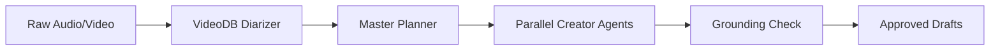

# 🚀 EventAI Content Generation Master Guidelines

This guide details the exact blueprints, prompt architectures, structural templates, and quality criteria used by the **EventAI Multi-Agent Editorial Room** to generate high-performance content across all 5 key formats: **Instagram Posts**, **Newsletters**, **Technical Blogs**, **Executive Summaries**, and **Event Flyers**.

---

## 📑 Quick Navigation
1. [📸 Instagram Post (Carousel & High-Engagement Caption)](#1--instagram-post-carousel--high-engagement-caption)
2. [📧 Newsletter (Curated, Skimmable & Value-Packed)](#2--newsletter-curated-skimmable--value-packed)
3. [📰 Technical Blog Post (SEO & Developer-Focused)](#3--technical-blog-post-seo--developer-focused)
4. [📝 Executive Summary (C-Level & Stakeholder Brief)](#4--executive-summary-c-level--stakeholder-brief)
5. [🎨 Event Flyer & Promotional Poster](#5--event-flyer--promotional-poster)
6. [🛡️ Multi-Agent Guardrails & Quality Standards](#6-️-multi-agent-guardrails--quality-standards)

---

## 1. 📸 Instagram Post (Carousel & High-Engagement Caption)

### 🎯 Primary Objective
Stop the user's scroll within 1.5 seconds, provide high-density educational/event value across a 5-slide carousel, and drive post saves, shares, and comment discussions.

### 📐 Golden Structure & Blueprint
```
[CAROUSEL BREAKDOWN]
📸 Slide 1 (Cover Card): High-contrast bold title + Hook badge ("What 90% of devs miss about Multi-Agent AI")
📸 Slide 2 (Core Challenge): The friction point discussed in the event.
📸 Slide 3 (The Breakthrough): Key architecture pattern or drop-mic realization.
📸 Slide 4 (Key Takeaways Checklist): 3 bullet points with custom visual cues.
📸 Slide 5 (Action / CTA Card): "Save this for your next build 🔖 | Tag a teammate 👇"

[CAPTION COPY]
🔥 [HOOK LINE]: First 120 characters before the "...more" fold.
📖 [NARRATIVE]: 2-3 short, spaced-out sentences capturing the event atmosphere.
✨ [KEY TAKEAWAYS]:
  🔹 Insight 1: Real-world engineering application.
  🔹 Insight 2: Speaker quote with attribution.
  🔹 Insight 3: Immediate actionable tip.
📍 [BRAND ATTRIBUTION]:
  • Hosted by: {organization}
  • Speaker: {full_name} (@{instagram_handle})
  • Full Resource: {website_url}
💬 [CTA]: "Which takeaway resonated most? Drop 1, 2, or 3 in the comments!"
🏷️ [HASHTAGS]: 10-12 curated tags (Broad + Niche + Local Community).
```

### 📦 Output JSON Schema
```json
{
  "type": "instagram",
  "title": "5 Key Takeaways from Event Keynote",
  "body": "Markdown formatted Instagram caption with spacing and emojis",
  "structured": {
    "hook": "Stop wasting 20 hours on manual event recaps ⚡",
    "carousel_slides": [
      { "slide_number": 1, "header": "The 3-Min Content Pipeline", "body_text": "How we automated event publishing.", "design_note": "Dark mode neon violet background" },
      { "slide_number": 2, "header": "Step 1: VideoDB Diarization", "body_text": "High-accuracy speaker tracking.", "design_note": "Waveform graphic" },
      { "slide_number": 3, "header": "Step 2: LangGraph Fan-Out", "body_text": "Parallel generation across 6 specialized agents.", "design_note": "Node network diagram" },
      { "slide_number": 4, "header": "Step 3: Dual Guardrails", "body_text": "Automated grounding check prevents hallucinations.", "design_note": "Shield checkmark icon" },
      { "slide_number": 5, "header": "Try It Today", "body_text": "Save this post & check link in bio!", "design_note": "Bookmark CTA icon" }
    ],
    "image_prompt": "Cinematic 3D render of AI nodes communicating in neon cyan and dark purple space, 8k resolution, minimalist typography overlay.",
    "hashtags": ["#AICommunity", "#LangGraph", "#TechMeetup", "#DeveloperLife", "#PythonDev", "#EventAI"]
  }
}
```

---

## 2. 📧 Newsletter (Curated, Skimmable & Value-Packed)

### 🎯 Primary Objective
Deliver high open rates (>45%) with irresistible subject lines, clear section hierarchy, bold takeaways, and high click-through rates (CTR).

### 📐 Golden Structure & Blueprint
```
[SUBJECT & PREHEADER]
📬 Subject Line: Curiosity/Benefit-driven (e.g., "How to ship multi-agent workflows in 3 mins ⚡")
👀 Preheader: "Key lessons, architecture diagrams, and speaker notes from Pune AI Summit."

[SALUTATION & INTRO]
👋 "Hey everyone, welcome back to {organization} Weekly! It's {full_name} here."
A 2-paragraph narrative introducing the core theme and why it matters right now.

[MAIN FEATURE: THE DEEP DIVE]
1. 🎯 The Paradigm Shift (Old way vs. new way)
2. 🛠️ Practical Architecture (How it works under the hood)
3. 📊 Real-world Benchmarks & Results

[SPEAKER QUOTE BLOCK]
> "Exact memorable quote from the talk transcript."
> — Speaker Name, Title at Organization

[QUICK HITS & RESOURCES]
• 🔗 Resource 1: Open source repository link
• 🔗 Resource 2: Interactive demo link

[SIGN-OFF]
Warm personal sign-off using {custom_signoff}, job title, and organization.
```

---

## 3. 📰 Technical Blog Post (SEO & Developer-Focused)

### 🎯 Primary Objective
Rank on search engines, explain complex system architectures clearly with Mermaid diagrams and code snippets, and establish engineering authority.

### 📐 Golden Structure & Blueprint
```
# [SEO OPTIMIZED TITLE]: E.g., "Building Production-Grade Multi-Agent Workflows with LangGraph and FastAPI"

> **Meta Description:** Learn how to architect a multi-agent editorial room with parallel fan-out extraction, centralized memory injection, and grounding guardrails.
> **Reading Time:** ⏱️ 6 min read | **Author:** {full_name}, {job_title} at {organization}

## 1. Executive Overview & Problem Statement
- The operational bottleneck: manual post-event repurposing takes 10–20 hours.
- The architectural target: asynchronous Celery task worker + LangGraph state machine.

## 2. System Architecture & Data Flow


## 3. Deep-Dive Implementation Patterns
- Fan-out pattern implementation.
- Handling LLM retries and exponential backoff with circuit breakers.
- Code blocks with complete syntax highlighting.

## 4. Benchmark & Latency Analysis
| Stage | Sequential Execution | Parallel Fan-out | Speedup |
| :--- | :--- | :--- | :--- |
| Extraction | 18.2s | 4.1s | 4.4x |
| Content Generation | 34.5s | 7.8s | 4.4x |

## 5. Conclusion & Key Takeaways
Summary of lessons learned and link to GitHub repository: `{website_url}`.
```

---

## 4. 📝 Executive Summary (C-Level & Stakeholder Brief)

### 🎯 Primary Objective
Provide senior executives and managers with a 60-second read detailing strategic impact, quantifiable metrics, and actionable decisions.

### 📐 Golden Structure & Blueprint
```
# 📋 Executive Briefing: [Event / Keynote Title]
**Host:** {organization} | **Lead Speaker:** {full_name} | **Date:** [Date]

## 🎯 1. Executive TL;DR (Bottom Line Up Front)
- 📌 **Core Achievement:** Compressed 20-hour content repurposing cycle into 3 minutes.
- ⚡ **Strategic Impact:** Enables 10x content output with zero incremental headcount.

## 📊 2. Key Metrics & ROI
- **92% Reduction** in turnaround time for event marketing collateral.
- **100% Grounding Accuracy** verified via dual-pass transcript cross-referencing.
- **Zero Hallucination** tolerance enforced by automated moderation gates.

## 🔑 3. Strategic Recommendations
1. **Adopt Parallel Fan-Out Architectures:** Decouple monolithic LLM pipelines into isolated micro-agents.
2. **Implement Centralized Brand Memory:** Ensure consistent voice, tone, and attribution across all output channels.

## ✅ 4. Action Items & Ownership
| Action Item | Owner | Timeline | Priority |
| :--- | :--- | :--- | :--- |
| Deploy Phase 1 Production Workers | Platform Team | Immediate | P0 |
| Connect Cloudflare R2 Storage Adapter | DevOps | Week 2 | P1 |
```

---

## 5. 🎨 Event Flyer & Promotional Poster

### 🎯 Primary Objective
Drive event registration conversions through high-impact visual hierarchy, prominent speaker highlights, and clear venue/registration logistics.

### 📐 Golden Structure & Blueprint
```
[HERO BADGE]
🏷️ NATIONAL AI & AGENTIC SYSTEMS SYMPOSIUM 2026

[HEADLINE & VALUE PROP]
🚀 "From Raw Speech to Multi-Platform Publishing in 180 Seconds"

[KEYNOTE SPEAKER CALLOUT]
🎙️ Keynote by: **{full_name}**  
💼 {job_title}, {organization}

[LOGISTICS GRID]
📅 Date: [Date]  
⏰ Time: [Start Time - End Time]  
📍 Venue: [Auditorium / City / Online Stream]  
🎟️ Registration: Free Admission (Seats Limited)  

[CALL TO ACTION]
👉 Scan QR / Register at: {website_url}  
🔗 Inquiries: @{instagram_handle} | in/{linkedin_handle}

[COMMUNITY BROADCAST TEASER (WhatsApp/Slack/Telegram)]
📢 *Upcoming Tech Session Announcement:*  
Join us this weekend for an exclusive session with {full_name} on AI pipelines!  
👉 Register free here: {website_url}
```

---

## 6. 🛡️ Multi-Agent Guardrails & Quality Standards

To maintain deterministic quality across all generated formats:
1. **Grounding Verification:** Every generated draft is lexically scored against the source `<TRANSCRIPT>`. Unverified claims trigger an automated single-retry self-correction loop.
2. **Brand Memory Injection:** Centralized user profile metadata (`full_name`, `organization`, `job_title`, `handles`, `brand_tone`) is injected into each agent's system prompt.
3. **Noisy Data Gate:** If audio silence exceeds 40% or speech confidence is below 0.35, the ingestion gate halts processing and requests a clearer recording.
