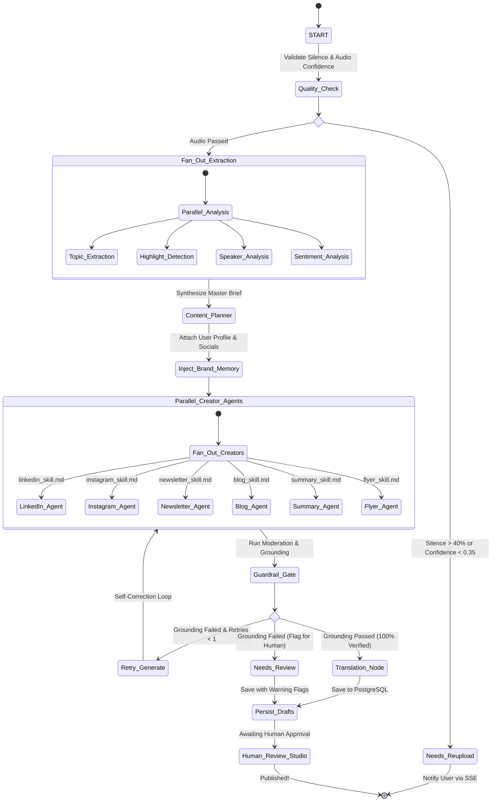
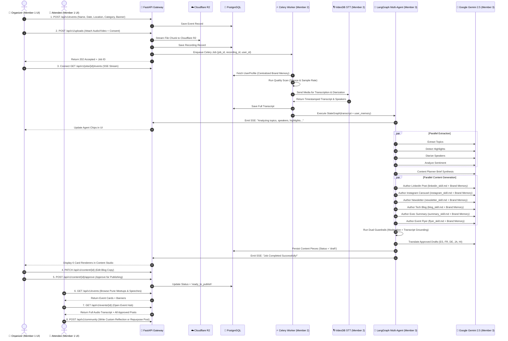
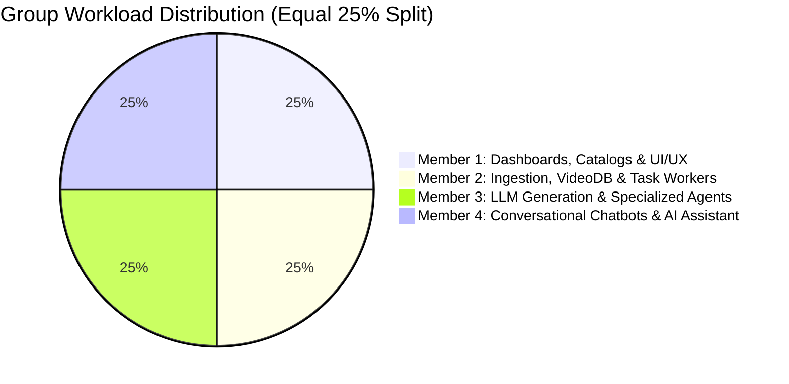
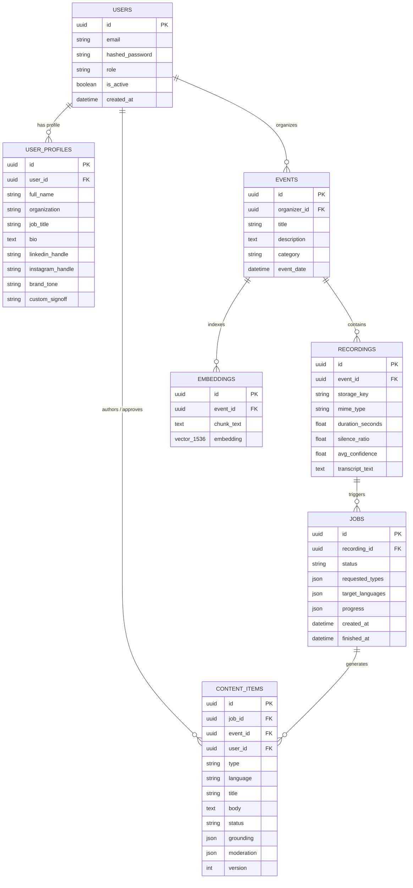

# 🚀 EventAI: Master Group Project Blueprint & Technical Specification

> **Intelligent Event Recording → Multi-Agent Content Generation Platform**  
> *Academic Year 2025–2026 | Final Year Project Specification*

---

## 📖 1. Executive Summary & Project Vision

### 1.1 The Problem
Following any tech conference, workshop, university symposium, or corporate townhall, marketing and content teams spend **10 to 20 hours manually**:
1. Listening to or reading raw recordings/transcripts.
2. Taking notes, finding timestamps, and extracting key insights.
3. Rewriting content into 6+ different formats (LinkedIn posts, Instagram captions, Newsletters, Technical Blogs, Executive Summaries, and Event Flyers).
4. Ensuring branding, author names, and social media handles are consistent.
5. Manually verifying that the generated copy does not hallucinate false information.

### 1.2 The EventAI Solution
**EventAI** is a cloud-native, multi-agent AI web application that compresses this 20-hour workflow into a **3-minute automated pass**:
- **Ingestion & Transcription**: Ingests audio/video recordings, performs automated audio quality/silence validation, and transcribes speech using VideoDB.
- **Centralized User & Brand Memory**: Authenticates creators and automatically injects their name, organization, job title, social handles, and brand tone into every output.
- **Multi-Agent Editorial Room**: Deploys a team of **specialized AI agents** running in parallel (LinkedIn Specialist, Instagram Storyteller, Newsletter Editor, Technical Blog Author, Executive Summarizer, and Event Flyer Designer), each guided by isolated `skill.md` persona specifications.
- **Dual Guardrails & Grounding**: Automatically screens text against moderation policies and performs lexical grounding verification against the original transcript to prevent AI hallucinations.
- **Human-in-the-Loop Content Studio**: A modern dark-mode UI with live inline editing, one-click clipboard copying, multi-format export (`.md`, `.txt`, `.json`), and an approval gate before anything is marked `ready_to_publish`.

---

## 🏗️ 2. End-to-End System Architecture

### 2.1 Full-Stack Layered Architecture Diagram

```mermaid
graph TD
    subgraph Layer1["🌐 1. Presentation Layer (Member 1 & Member 4)"]
        Browser["Desktop & Mobile Browsers"]
        ReactApp["React 19 + TypeScript + Vite SPA<br/>• TailwindCSS 'Deep Signal' UI<br/>• Golden-Ratio Layout (61.8% / 38.2%)"]
        
        subgraph Portals["Dashboards & Views"]
            OrgDash["🏢 Organizer Dashboard<br/>(Create Event, Upload Audio/Video)"]
            UserDash["👥 Attendee Portal & Catalog<br/>(Pune Meetups, Events, Speeches)"]
            EventHub["🔍 Event Hub & Transcript Viewer<br/>(Full Audio Transcript + 6 Posts)"]
            Studio["✍️ Content Studio & Review Gate<br/>(Live Markdown Editor, 1-Click Copy)"]
            ProfileUI["👤 Creator Brand Memory Profile<br/>(Name, Org, Social Handles, Tone)"]
            ChatAssist["🤖 Dual Chat Assistants (Member 4)<br/>• Organizer Co-Pilot Slide-over<br/>• Attendee Q&A Floating Widget"]
        end
        
        Browser --> ReactApp
        ReactApp --> Portals
    end

    subgraph Layer2["🚀 2. API Gateway & Security Layer (Members 1, 2, 4)"]
        FastAPI["FastAPI Async REST API Engine (Port 8000)"]
        AuthMiddleware["JWT Authentication & RBAC<br/>(Admin, Organizer, Creator Roles)"]
        SSEHub["Server-Sent Events (SSE) Dispatcher<br/>(Real-Time Agent Progress Stream)"]
        ChatStream["SSE Chatbot Stream /api/v1/chat/stream<br/>(Real-Time Token Streaming - Member 4)"]
        StorageAdapter["Cloud Storage Adapter<br/>(Cloudflare R2 / AWS S3 / Local Disk)"]
        
        ReactApp -->|REST API Requests| FastAPI
        ReactApp -->|Live SSE Stream /api/v1/jobs/{id}/events| SSEHub
        ReactApp -->|Live Chat Streaming /api/v1/chat/stream| ChatStream
        FastAPI --> AuthMiddleware
        FastAPI --> ChatStream
        FastAPI --> StorageAdapter
    end


    subgraph Layer3["💾 3. Persistence & Message Broker Layer"]
        DB[("PostgreSQL 16 Relational DB<br/>• Users & Centralized Brand Profiles<br/>• Events, Recordings, Transcripts<br/>• Generated Content Items & Versions")]
        RedisQueue[("Redis 7 Cache & Message Broker<br/>• Celery Task Queue (Broker DB 1)<br/>• SSE Status Cache (DB 0)")]
        R2Bucket[("Cloudflare R2 Object Storage<br/>(Zero Egress Media File Storage)")]
        
        FastAPI --> DB
        StorageAdapter --> R2Bucket
        FastAPI -->|Enqueue Processing Jobs| RedisQueue
    end

    subgraph Layer4["⚡ 4. Asynchronous Media Processing Layer (Member 2)"]
        CeleryWorker["Celery Distributed Task Worker"]
        QualityModule["Pre-flight Audio Scanner<br/>(Waveform Silence Ratio & Sample Rate)"]
        VideoDBClient["VideoDB Speech-to-Text Engine<br/>(High-Accuracy Diarized Transcription)"]
        
        RedisQueue -->|Pull Jobs| CeleryWorker
        CeleryWorker --> QualityModule
        QualityModule --> VideoDBClient
    end

    subgraph Layer5["🤖 5. Multi-Agent AI Editorial Room (Member 3)"]
        StateGraph["LangGraph StateGraph Engine"]
        MemoryInjector["Centralized Brand Memory Injector<br/>(Merges User Profile + Transcript)"]
        
        subgraph StageA["Parallel Extraction (Fan-Out 1)"]
            TopicNode["Topic Extractor Agent"]
            HighlightNode["Highlight Detector Agent"]
            SpeakerNode["Speaker Diarizer Agent"]
            SentimentNode["Sentiment Analyst Agent"]
        end
        
        PlannerNode["Master Content Planner Agent<br/>(Synthesizes Unified Editorial Brief)"]
        
        subgraph StageB["Specialized Parallel Copywriters (Fan-Out 2)"]
            LinkedInAgent["💼 LinkedIn Agent<br/><i>(Reads linkedin_skill.md)</i>"]
            InstagramAgent["📸 Instagram Agent<br/><i>(Reads instagram_skill.md)</i>"]
            NewsletterAgent["📧 Newsletter Agent<br/><i>(Reads newsletter_skill.md)</i>"]
            BlogAgent["📰 Technical Blog Agent<br/><i>(Reads blog_skill.md)</i>"]
            SummaryAgent["📝 Executive Summary Agent<br/><i>(Reads summary_skill.md)</i>"]
            FlyerAgent["🎨 Event Flyer Agent<br/><i>(Reads flyer_skill.md)</i>"]
        end
        
        GuardrailNode["Dual Guardrails Gate<br/>• Content Moderation<br/>• Transcript Grounding Check"]
        TranslatorNode["Multi-Language Translator Agent<br/>(ES, FR, DE, JA, HI)"]
        
        VideoDBClient --> StateGraph
        StateGraph --> MemoryInjector --> StageA
        StageA --> PlannerNode --> StageB
        StageB --> GuardrailNode --> TranslatorNode
    end

    %% State and Feedback Loops
    TranslatorNode -->|Save Approved Drafts| DB
    StateGraph -->|Emit Step Updates| SSEHub
    SSEHub -->|Pulsing Status Chips| Studio
```

---

### 2.2 LangGraph Multi-Agent State Machine Diagram



---

### 2.3 End-to-End Data & Event Lifecycle Flow



---

## 👥 3. Four-Member Group Breakdown & Task Ownership



---

### 👤 Member 1: Dashboards, Community Boards & Frontend Lead
* **Primary Focus:** User Experience, Categorized Event Catalogs, Organizer & User Dashboards, Event Hub & Transcript Viewer, Content Studio, and Role Management.

#### Key Features Implemented:
1. **Categorized Event Discovery Catalog (Matching Screenshot & City Filter)**:
   - **Modern Carousel & Grid Interface:** Styled like the "Events in Pune" / "Browse popular activities" feed with "See all" actions and banner thumbnails.
   - **4 Dedicated Category Sections / Tabs:**
     - 👥 **Meetup:** Local tech meetups, hacknights, and invite-only community groups.
     - 🎤 **Speech / Keynote:** Keynote presentations, tech talks, and conference addresses.
     - 🎪 **Event / Conference:** Large-scale symposiums, multi-track summits, and expo sessions.
     - 📌 **Workshop / Session:** Hands-on labs, deep-dive training, and interactive panels.
   - **Rich Event Cards:** Includes banner poster thumbnail, category badge, formatted date & time (e.g., `Sat, Oct 17 · 10:00 AM IST`), event title, and host attribution (`by Docker Pune`).

2. **Organizer Event Creation & Management Suite (`OrganizerDashboard.tsx`)**:
   - **Event Creation Form:** Add events with Event Name, Category (`meetup`, `speech`, `event`, `session`), Date & Time, Location/City (e.g., "Pune"), Organizer Name, Banner Image, and Description.
   - **Media Upload & Ingestion Gate:** Upload audio/video or transcript with mandatory participant consent check.
   - **Associated Post Hub & Transcript:** Automatically attaches all 6 generated AI posts (Summary, Blog, LinkedIn, Newsletter, Instagram, Flyer) and the full speech-to-text transcript to the event.

3. **Interactive Event Hub & Full Transcript Viewer (`EventDetailPage.tsx` / `JobDetailPage.tsx`)**:
   - When an organizer or user clicks on any event card, it opens the Event Hub:
     - **Full Event Transcript:** Expandable, timestamped, searchable transcript viewer with one-click copy.
     - **All Generated Posts Grid:** View all 6 multi-agent pieces generated for that event.
     - **Audio Confidence & Quality Badges:** Displays signal-to-noise rating and duration.

4. **User / Attendee Portal & Post Repurposing (`UserDashboard.tsx`, `CommunityPage.tsx`)**:
   - **Browse & Learn:** Attendees can explore upcoming/past events by category and city, and read full transcripts.
   - **Use Existing Posts:** Attendees can directly copy and repurpose organizer-approved posts for their own social channels (LinkedIn, Instagram, Newsletter).
   - **Write Custom Reflections:** Attendees can write and publish their own takeaways and community posts linked to that event.

5. **Rich Content Studio & Review Suite (`ReviewPage.tsx`)**:
   - 6 dedicated card renderers with platform-native aesthetics.
   - Live inline markdown editor (`PATCH /api/v1/content/{id}`).
   - One-click copy to clipboard with toast notifications.
   - Multi-format asset exporter (`.md`, `.txt`, `.json`).
   - Human-in-the-loop review gate (`Approve` / `Reject with Feedback`).

6. **Creator Profile & Centralized Brand Memory UI (`SettingsPage.tsx`)**:
   - Interface for users to save their Full Name, Job Title, Organization, Social Handles (`@linkedin`, `@instagram`), Brand Tone, and Custom Sign-off.

#### Technologies Used:
`React 19`, `TypeScript`, `Vite`, `TailwindCSS`, `Lucide Icons`, `TanStack Query`, `Zustand`, `React Router v6`.

#### Files & Folders Owned:
- `client/src/pages/` (OrganizerDashboard, UserDashboard, CatalogPage, CommunityPage, JobDetailPage, ReviewPage, SettingsPage, LoginPage, RegisterPage).
- `client/src/components/dashboard/` (EventCard, CatalogNav, CreatePostForm, StatsGrid).
- `client/src/components/content/renderers/` (BlogArticle, ExecutiveSummary, LinkedInCard, NewsletterPreview, InstagramCard, FlyerPreview).
- `client/src/components/pipeline/` (AgentStatusChip, LivePipelineTracker).
- `client/src/store/` (auth.ts, ui.ts).
- `client/src/lib/api.ts` (Typed REST client).
- `server/app/api/v1/auth.py`, `events.py`, `content.py` (API endpoints supporting the UI).

#### Viva / Defense Presentation Points:
- Explain the **Golden-Ratio Layout (61.8% / 38.2%)** and "Deep Signal" dark aesthetic.
- Demonstrate real-time **Server-Sent Events (SSE)** connection updating agent chips without polling.
- Showcase the **Human-in-the-Loop review gate** guaranteeing zero unverified AI output goes live.

---

### 👤 Member 2: VideoDB Ingestion, Workers & Multi-Agent Parallel Analysis Lead
* **Primary Focus:** Distributed Asynchronous Systems, Media Quality Verification, Cloud STT, and LangGraph Parallel Fan-out.

#### Key Features Implemented:
1. **Cloud Media Storage & Upload Manager (`services/storage.py`, `api/v1/uploads.py`)**:
   - S3-compatible cloud object storage adapter (Cloudflare R2 for zero-egress fees, AWS S3, MinIO) with automatic fallback to local disk.
   - Chunked streaming upload handler with SHA-256 integrity verification.
2. **Pre-flight Audio Quality & Silence Scanner (`services/quality.py`)**:
   - Audio waveform analysis detecting silence ratio, clipping, sample rate, and audio duration.
   - Automatic routing gate: if silence ratio > 40% or confidence < 0.35, flags `needs_reupload` to prevent wasting LLM tokens.
3. **VideoDB Cloud Speech-to-Text Integration (`providers/videodb_stt.py`, `services/transcription.py`)**:
   - Direct integration with VideoDB API for high-accuracy speech transcription, speaker timestamps, and scene indexing.
   - Embedded `FakeSTTProvider` for offline development and unit testing without consuming API credits.
4. **Asynchronous Distributed Task Processing (`workers/celery_app.py`, `workers/tasks.py`)**:
   - Celery worker connected to Redis message broker handling long-running background tasks.
   - Automated media retention cron job purging raw audio files after configured days to adhere to GDPR/data privacy laws.
5. **LangGraph State Initialization & Parallel Extraction Fan-out (`graphs/nodes/quality.py`, `graphs/nodes/analysis.py`)**:
   - State graph definition (`JobGraphState`).
   - Concurrent parallel execution of 4 extractor agents:
     - **Topic Extractor Agent:** Extracts key taxonomy, technologies, and discussion themes.
     - **Highlight Detector Agent:** Identifies high-energy moments, breakthrough announcements, and key takeaways.
     - **Speaker Diarizer Agent:** Resolves speaker turns, names, and titles.
     - **Sentiment Analyst Agent:** Gauges audience engagement, energy level, and tone.

#### Technologies Used:
`FastAPI`, `Celery`, `Redis`, `VideoDB Python SDK`, `boto3` (Cloudflare R2 / S3), `librosa` / `soundfile` / `wave`, `LangGraph (StateGraph)`.

#### Files & Folders Owned:
- `server/app/workers/` (celery_app.py, tasks.py).
- `server/app/services/quality.py` (Audio silence and quality scanner).
- `server/app/services/transcription.py` (STT provider router).
- `server/app/services/storage.py` (Cloudflare R2 / AWS S3 / Local storage adapter).
- `server/app/providers/videodb_stt.py` (VideoDB API client).
- `server/app/graphs/state.py` (TypedDict state definition).
- `server/app/graphs/nodes/quality.py` (Quality gate node).
- `server/app/graphs/nodes/analysis.py` (Parallel fan-out extraction nodes).
- `server/app/api/v1/uploads.py`, `jobs.py` (Upload and SSE progress streaming endpoints).

#### Viva / Defense Presentation Points:
- Explain how **Celery + Redis** decouples heavy audio processing from FastAPI's event loop to prevent API blocking.
- Demonstrate how **LangGraph Fan-Out** cuts analysis execution time by ~75% compared to linear sequential processing.
- Explain the security and privacy benefits of **automated media retention auto-purge**.

---

### 👤 Member 3: LLM Generation, Specialized Multi-Agents, Guardrails & Centralized Memory Lead
* **Primary Focus:** Generative AI Architecture, Specialized Agent Personas (`skill.md`), Centralized Brand Memory, Anti-Hallucination & Moderation Guardrails, and Multi-Language Translation.

#### Key Features Implemented:
1. **Centralized User & Brand Memory System (`models/user.py`, `schemas/auth.py`)**:
   - Stores user credentials, job title, company, social handles, and brand style preferences.
   - Dynamically injects `user_memory` into agent prompts so every output is personalized with author credentials.
2. **Master Content Planner Synthesis (`graphs/nodes/planner.py`)**:
   - Aggregates topics, highlights, speakers, and sentiment from Stage 2 into a structured Master Editorial Brief.
3. **Specialized Multi-Agent Editorial Room (`graphs/agents/`, `graphs/skills/`)**:
   - Deploys 6 dedicated creator agents running concurrently via parallel fan-out:
     - **💼 LinkedIn Agent (`linkedin_agent.py` & `linkedin_skill.md`):** Hooks, 3-4 bullet takeaways, engagement question, business hashtags, author sign-off.
     - **📸 Instagram Agent (`instagram_agent.py` & `instagram_skill.md`):** Emojis, slide descriptions, caption spacing, creator tags.
     - **📧 Newsletter Agent (`newsletter_agent.py` & `newsletter_skill.md`):** Catchy subject line, editorial story breakdown, quotes, clear CTA.
     - **📰 Technical Blog Agent (`blog_agent.py` & `blog_skill.md`):** SEO title, reading time, H2/H3 hierarchy, technical depth.
     - **📝 Executive Summary Agent (`summary_agent.py` & `summary_skill.md`):** 3-sentence TL;DR, strategic decisions, action items.
     - **🎨 Event Flyer Agent (`flyer_agent.py` & `flyer_skill.md`):** Headline, keynote speaker callout, date/venue, RSVP badge.
4. **Dual Guardrails & Grounding Verification (`services/guardrails.py`, `graphs/nodes/guardrails.py`)**:
   - Automated content moderation check (screening profanity, PII, toxicity).
   - Lexical and semantic grounding check matching claims against the raw transcript. If grounding score < threshold, triggers an automated one-pass self-correction loop.
5. **Multi-Language Translation Engine (`graphs/nodes/translator.py`)**:
   - Automatically translates approved drafts into target languages (Spanish, French, German, Japanese, Hindi) with cultural nuance preservation.

#### Technologies Used:
`Google Gemini API (gemini-2.5-flash / gemini-1.5-flash)`, `LangGraph`, `SQLAlchemy 2.0`, `Pydantic v2`.

#### Files & Folders Owned:
- `server/app/graphs/agents/` (base.py, linkedin_agent.py, instagram_agent.py, newsletter_agent.py, blog_agent.py, summary_agent.py, flyer_agent.py).
- `server/app/graphs/skills/` (linkedin_skill.md, instagram_skill.md, newsletter_skill.md, blog_skill.md, summary_skill.md, flyer_skill.md).
- `server/app/graphs/nodes/planner.py` (Master brief node).
- `server/app/graphs/nodes/guardrails.py` (Moderation & grounding gate node).
- `server/app/graphs/nodes/translator.py` (Translation node).
- `server/app/providers/gemini_llm.py` (Google Gemini SDK wrapper).
- `server/app/services/guardrails.py` (Moderation & transcript grounding algorithms).

---

### 👤 Member 4: Conversational Chatbot & Interactive Event AI Assistant Lead
* **Primary Focus:** Dual-Persona Conversational AI Agents, Real-Time Token Streaming, Event Context Grounding, Organizer AI Co-Pilot, and Attendee "Talk to the Transcript" Assistant.

#### Key Features Implemented:
1. **Organizer AI Co-Pilot Assistant (`ChatDrawer.tsx`, `chat_service.py`)**:
   - **Transcript & Moment Lookup:** Ask questions to locate exact timestamps and quotes (e.g., *"When did the speaker discuss Docker multi-stage builds?"*).
   - **Audience & Sentiment Insights:** Summarizes audience reception, energy levels, and key debate topics from the session.
   - **On-Demand Copy Revision & Custom Hooks:** Request real-time revisions (e.g., *"Make the LinkedIn hook 20% punchier"* or *"Write a 1-line announcement tweet for tomorrow"*).
   - **Promotional Scheduler:** Generates recommended posting timelines and platform release schedules.

2. **Attendee "Talk to the Event" Q&A Chatbot (`EventChatWidget.tsx`)**:
   - **Embedded on Event Hub:** Attendees can chat directly with the event recording/transcript.
   - **Interactive Q&A:** Answers questions strictly grounded in the speaker's presentation (e.g., *"What were the 3 main trade-offs mentioned for microservices?"*).
   - **Custom Takeaways & Post Brainstorming:** Helps attendees brainstorm their own unique community posts or LinkedIn reflections.
   - **Direct Speaker Quote Attribution:** Returns exact speaker quotes and session timestamps for reference.

3. **High-Performance Token Streaming API (`/api/v1/chat/stream`)**:
   - Implements async token streaming via `FastAPI StreamingResponse` / Server-Sent Events (SSE) for sub-200ms Time-to-First-Token (TTFT).
   - Real-time markdown rendering with code block syntax highlighting and copy buttons.

4. **Conversational Memory & Session Management (`models/chat.py`, `schemas/chat.py`)**:
   - Multi-turn conversation history stored per event and user session.
   - Smart context window sliding/truncation to handle long 2-hour event transcripts without exceeding LLM context limits or bloating token budgets.

#### Technologies Used:
`FastAPI StreamingResponse`, `Google Gemini Flash API`, `React Chat UI Primitives`, `SSE / WebSockets`, `SQLAlchemy 2.0`, `Pydantic v2`.

#### Files & Folders Owned:
- `client/src/components/chat/` (ChatDrawer.tsx, EventChatWidget.tsx, ChatMessage.tsx, SuggestedPrompts.tsx).
- `client/src/hooks/useChatStream.ts` (Streaming hook with auto-scroll and markdown parsing).
- `server/app/api/v1/chat.py` (REST endpoints for session management & `/stream` SSE endpoint).
- `server/app/services/chat_service.py` (Prompt builder, transcript grounding, and Gemini streaming client).
- `server/app/models/chat.py` (ChatSession and ChatMessage database models).
- `server/app/schemas/chat.py` (ChatRequest, ChatResponse, StreamChunk DTOs).

#### Viva / Defense Presentation Points:
- Demonstrate the **Dual Chatbot Persona** (Organizer Co-Pilot vs Attendee Q&A Assistant).
- Explain how **Token-by-Token Streaming** over SSE provides an immediate, responsive user experience compared to blocking HTTP requests.
- Showcase how **Strict Grounding Prompts** ensure the chatbot never invents facts outside of the session transcript.

---

## 🗂️ 4. Complete Project Directory Structure

```
Final_year_project/
├── .env.example                               # Unified environment configuration template
├── docker-compose.yml                         # Multi-container orchestration (PostgreSQL, Redis, API, Worker, Client)
├── README.md                                  # Top-level quickstart and project overview
│
├── docs/                                      # Master Documentation Suite
│   ├── EventAI_Master_Group_Specification.md  # [THIS DOCUMENT] Master group specification
│   ├── EventAI_Project_Plan.md                # 10-stage engineering blueprint
│   ├── Final_Year_Project_Report.md           # Academic evaluation report
│
├── client/                                    # 👤 MEMBER 1 & MEMBER 4 WORKSPACE (Frontend)
│   ├── index.html

│   ├── package.json
│   ├── vite.config.ts
│   ├── tailwind.config.js
│   ├── Dockerfile
│   └── src/
│       ├── App.tsx                            # Root application & routing table
│       ├── main.tsx                           # React DOM mount point
│       ├── pages/                             # Route Page Components
│       │   ├── OrganizerDashboard.tsx         # [Member 1] Organizer upload, catalog management & Co-Pilot
│       │   ├── UserDashboard.tsx              # [Member 1] Attendee portal & personal dashboard
│       │   ├── CatalogPage.tsx                # [Member 1] Pune Event discovery catalog (Meetup, Event, Speech, Session)
│       │   ├── EventDetailPage.tsx            # [Member 1] Event Hub with audio transcript & all 6 generated posts
│       │   ├── CommunityPage.tsx              # [Member 1] Community reflections & repurposing feed
│       │   ├── JobDetailPage.tsx              # [Member 1] Live SSE pipeline progress & studio viewer
│       │   ├── ReviewPage.tsx                 # [Member 1] Human-in-the-loop review & approval gate
│       │   ├── SettingsPage.tsx               # [Member 1/3] Brand memory & creator profile settings
│       │   ├── LoginPage.tsx                  # JWT authentication login
│       │   └── RegisterPage.tsx               # Account creation & role picker
│       ├── components/
│       │   ├── chat/                          # 👤 Member 4: Conversational AI Assistants
│       │   │   ├── ChatDrawer.tsx             # Organizer AI Co-Pilot slide-over panel
│       │   │   ├── EventChatWidget.tsx        # Attendee "Talk to the Transcript" floating Q&A widget
│       │   │   └── README.md                  # Member 4 Chat developer guide
│       │   ├── dashboard/                     # 👤 Member 1: Dashboard UI widgets & cards
│       │   │   ├── EventCard.tsx              # Event summary card with hub link
│       │   │   ├── CatalogNav.tsx             # Tab navigation for discovery
│       │   │   ├── DashboardUploadCard.tsx    # Fast upload interface with language/type selector
│       │   │   ├── CreatePostForm.tsx         # Community reflection writer
│       │   │   └── README.md                  # Member 1 Dashboard developer guide
│       │   ├── content/renderers/             # 6 Specialized Content Studio Card Renderers
│       │   │   ├── BlogArticle.tsx            # Long-form article with reading time
│       │   │   ├── ExecutiveSummary.tsx       # C-suite executive briefing card
│       │   │   ├── LinkedInCard.tsx           # LinkedIn feed card with hashtag cloud
│       │   │   ├── NewsletterPreview.tsx      # Email template with CTA button
│       │   │   ├── InstagramCard.tsx          # Social media card with emoji formatting
│       │   │   └── FlyerPreview.tsx           # Golden-ratio portrait flyer preview
│       │   ├── pipeline/                      # Live State Tracking Widgets
│       │   │   ├── AgentStatusChip.tsx        # Dynamic pulsing agent badge
│       │   │   ├── LivePipelineTracker.tsx    # Multi-agent state visualization panel
│       │   │   └── PipelineStepper.tsx        # Step-by-step progress stepper
│       │   └── ui/                            # Design system primitives (Button, Modal, Toast, Badge)
│       ├── hooks/                             # Custom React Hooks
│       │   └── useChatStream.ts               # [Member 4] SSE token streaming hook
│       ├── store/                             # Global state management (auth.ts, theme.ts)
│       └── lib/                               # API client and utilities (api.ts, formatters.ts)
│
├── server/                                    # 👤 BACKEND WORKSPACE (Members 2, 3, 4)
│   ├── requirements.txt                       # Production Python dependencies
│   ├── requirements-dev.txt                   # Development & testing tools (pytest, ruff)
│   ├── Dockerfile
│   ├── alembic.ini                            # Database migration configuration
│   └── app/
│       ├── main.py                            # FastAPI Application Factory & Lifespan
│       ├── core/                              # Core Utilities & Configurations
│       │   ├── config.py                      # Pydantic BaseSettings & Environment variables
│       │   ├── security.py                    # Password hashing & JWT token issuance
│       │   ├── exceptions.py                  # Standard HTTP error factory
│       │   └── logging.py                     # Structured JSON logging
│       ├── db/                                # Database Persistence
│       │   ├── session.py                     # Async engine & sessionmaker
│       │   └── base.py                        # Declarative Base
│       ├── models/                            # SQLAlchemy ORM Models
│       │   ├── user.py                        # User & UserProfile (Brand Memory) models
│       │   ├── event.py                       # [Member 1] Event metadata model
│       │   ├── recording.py                   # [Member 2] Media recording & transcript model
│       │   ├── job.py                         # [Member 2] Processing job lifecycle model
│       │   ├── content.py                     # [Member 3] Generated content drafts & versions
│       │   └── chat.py                        # [Member 4] ChatSession & ChatMessage models
│       ├── schemas/                           # Modular Pydantic DTOs & API Contracts
│       │   ├── auth.py                        # Register, Login, Token, UserProfile schemas
│       │   ├── events.py                      # [Member 1] Event creation & update schemas
│       │   ├── jobs.py                        # [Member 2] Job submission, status & SSE progress schemas
│       │   ├── content.py                     # [Member 3] Content patch, approval, rejection schemas
│       │   ├── chat.py                        # [Member 4] Chat request, response, streaming schemas
│       │   └── common.py                      # Base ORM config & health response schemas
│       ├── api/                               # REST Routing Layer
│       │   ├── deps.py                        # Dependency Injection (DB, Current User, RBAC)
│       │   └── v1/
│       │       ├── router.py                  # API v1 Master Router
│       │       ├── auth.py                    # Auth & User Profile endpoints
│       │       ├── uploads.py                 # [Member 2] Media upload & quality validation endpoints
│       │       ├── jobs.py                    # [Member 2] Job submission & SSE event stream endpoints
│       │       ├── content.py                 # [Member 3] Content retrieval, patch & approval endpoints
│       │       ├── events.py                  # [Member 1] Event CRUD & community feed endpoints
│       │       ├── chat.py                    # [Member 4] Dual-persona chat sessions & /stream SSE endpoint
│       │       ├── admin.py                   # System diagnostics & retention purge endpoints
│       │       └── health.py                  # Liveness and readiness endpoints
│       ├── workers/                           # 👤 Member 2: Async Background Worker
│       │   ├── celery_app.py                  # Celery worker instance
│       │   ├── tasks.py                       # Async job orchestration tasks
│       │   └── README.md                      # Member 2 Worker guide
│       ├── services/                          # Business Logic Services
│       │   ├── storage.py                     # [Member 2] Cloudflare R2 / AWS S3 / Local storage adapter
│       │   ├── quality.py                     # [Member 2] Audio silence and sample rate scanner
│       │   ├── transcription.py               # [Member 2] STT provider orchestration
│       │   ├── av_scan.py                     # [Member 2] Security scanner for uploaded files
│       │   ├── chat_service.py                # [Member 4] Dual-persona prompt builder & SSE generator
│       │   ├── guardrails.py                  # [Member 3] Content moderation & transcript grounding
│       │   └── job_runner.py                  # End-to-end pipeline runner & SSE dispatcher
│       ├── providers/                         # Cloud & AI Adapters
│       │   ├── videodb_stt.py                 # [Member 2] VideoDB Speech-to-Text integration
│       │   ├── fake_stt.py                    # [Member 2] Mock STT provider for offline dev/tests
│       │   ├── gemini_llm.py                  # [Member 3] Google Gemini generative model wrapper
│       │   ├── fake_llm.py                    # [Member 3] Mock LLM provider for offline dev/tests
│       │   └── factory.py                     # Dynamic provider factory
│       └── graphs/                            # 👤 Member 2 & 3: LangGraph AI Pipeline
│           ├── state.py                       # JobGraphState TypedDict definition (with user_memory)
│           ├── pipeline.py                    # StateGraph compilation & edge routing
│           ├── skills/                        # 👤 Member 3: Persona Guidelines (skill.md)
│           │   ├── linkedin_skill.md          # LinkedIn prompt & viral formatting rules
│           │   ├── instagram_skill.md         # Instagram carousel & caption rules
│           │   ├── newsletter_skill.md        # Newsletter narrative & CTA rules
│           │   ├── blog_skill.md              # Technical blog style guide
│           │   ├── summary_skill.md           # Executive summary TL;DR rules
│           │   ├── flyer_skill.md             # Event flyer poster copy rules
│           │   └── README.md                  # Member 3 Skills guide
│           ├── agents/                        # 👤 Member 3: Specialized Creator Agent Implementations
│           │   ├── base.py                    # BaseCreatorAgent loading skill.md + injecting user_memory
│           │   ├── linkedin_agent.py          # Dedicated LinkedIn generator
│           │   ├── instagram_agent.py         # Dedicated Instagram generator
│           │   ├── newsletter_agent.py        # Dedicated Newsletter generator
│           │   ├── blog_agent.py              # Dedicated Technical Blog generator
│           │   ├── summary_agent.py           # Dedicated Executive Summary generator
│           │   ├── flyer_agent.py             # Dedicated Event Flyer generator
│           │   ├── __init__.py                # AGENT_REGISTRY dictionary
│           │   └── README.md                  # Member 3 Agents guide
│           └── nodes/                         # Single-Responsibility LangGraph Nodes
│               ├── quality.py                 # [Member 2] Audio/video quality gate node
│               ├── analysis.py                # [Member 2] Parallel extraction (topics, highlights, speakers, sentiment)
│               ├── planner.py                 # [Member 3] Master editorial brief synthesizer
│               ├── generator.py               # [Member 3] Parallel specialized creator agents execution
│               ├── guardrails.py              # [Member 3] Grounding & moderation gate node
│               └── translator.py              # [Member 3] Multi-language localization node
│

├── data/samples/                              # Evaluation & Viva Demonstration Audio/Text Files
│   ├── clean_event_session.txt                # High-confidence sample recording transcript
│   └── noisy_audio_sample.txt                 # Low-confidence sample with grounding alerts
```

---

## 🔐 5. Centralized Database Schema



---

## ⚡ 6. How to Run & Test the Application

### 6.1 Quick Start with Docker Compose (Recommended)
```bash
# 1. Clone repository and copy environment template
cp .env.example .env

# 2. Add your API Keys in .env:
# GEMINI_API_KEY=your_gemini_api_key
# VIDEODB_API_KEY=your_videodb_api_key

# 3. Start all services:
docker compose up --build
```
* **Web UI:** http://localhost:8080
* **API Documentation (Swagger UI):** http://localhost:8000/docs
* **Health Endpoint:** http://localhost:8000/health

### 6.2 Manual Local Development (Without Docker for Dev)
```bash
# Start Database & Redis
docker compose up -d postgres redis

# Terminal 1: Backend Server
cd server
python -m venv .venv
# On Windows: .venv\Scripts\activate | On macOS/Linux: source .venv/bin/activate
pip install -r requirements-dev.txt
uvicorn app.main:app --reload --port 8000

# Terminal 2: Celery Worker
cd server
celery -A app.workers.celery_app.celery_app worker --loglevel=INFO

# Terminal 3: Frontend Client
cd client
npm install
npm run dev
# Open http://localhost:5173
```

### 6.3 Running the Automated Test Suite
```bash
cd server
pytest tests/ -v
```

---

## 🎯 7. Project Keynotes & Leader's Development Playbook

> **Strategic Guidelines from the Team Leader Perspective**  
> *Follow these 5 core engineering principles to guarantee smooth group collaboration and zero merge conflicts.*

### 7.1 Schema-First & Contract-Driven Development
- **Golden Rule:** Never write frontend UI components or backend endpoints before defining the Pydantic schemas in `server/app/schemas/`.
- Once schemas (`auth.py`, `events.py`, `jobs.py`, `content.py`, `chat.py`) are finalized, Member 1 can build frontend screens using mock data while Members 2, 3, and 4 build backend handlers in parallel without blocking each other.

### 7.2 Decoupled Development & Offline Mocking
- **Zero API Credit Wasting:** Do not use live VideoDB or Gemini API credits for unit testing or repetitive UI styling.
- Set `STT_PROVIDER=fake` in `.env` to use the pre-built sample recordings in `data/samples/`.
- Use the provided test suite (`pytest tests/`) to validate logic before running real audio files.

### 7.3 Git Branching & Merge Etiquette for 4 Members
- **Branch Naming Standard:**
  - `feature/member1-dashboards-catalog`
  - `feature/member2-videodb-workers`
  - `feature/member3-specialized-agents`
  - `feature/member4-event-chatbots`
- **Merge Protocol:** Never commit directly to `main`. Create Pull Requests, verify `pytest` passes 100%, and require at least one team member's review before merging.

### 7.4 Token Budget, Rate Limiting & Concurrency Guardrails
- Google Gemini and VideoDB enforce strict Requests-Per-Minute (RPM) and Tokens-Per-Minute (TPM) limits.
- When running 6 parallel creator agents, always wrap LLM invocations in the `with_backoff` circuit breaker (`server/app/services/resilience.py`) with a concurrency semaphore (`asyncio.Semaphore(3)`).

### 7.5 Database Migration Discipline
- Never alter database tables directly in PostgreSQL or use `Base.metadata.drop_all()`.
- Whenever modifying SQLAlchemy models (`User`, `Event`, `Recording`, `Job`, `ContentPiece`, `ChatSession`), generate an Alembic migration:
  ```bash
  cd server
  alembic revision --autogenerate -m "add_chat_session_table"
  alembic upgrade head
  ```

---

## 🛡️ 8. Failure Modes, Error Scenarios & Resolution Playbook

> **Leader's Troubleshooting Matrix**  
> *Comprehensive guide to common potential errors across all 4 tiers and their step-by-step resolutions.*

| Error / Scenario | Root Cause | Exact Resolution & Fix |
| :--- | :--- | :--- |
| **1. VideoDB STT Timeout / 401 Unauthorized** | Missing/invalid `VIDEODB_API_KEY` or cloud transcription timeout on long audio. | Automatic fallback is built-in to `FakeSTTProvider`. In `.env`, verify `VIDEODB_API_KEY`. For local testing, set `STT_PROVIDER=fake` to use sample transcript files instantly. |
| **2. Celery Worker Stalled / Status Stuck in `queued`** | Celery worker is not running, or `CELERY_BROKER_URL` points to wrong Redis port. | 1. Check Redis: `docker compose ps redis`.<br>2. Start worker in terminal: `celery -A app.workers.celery_app.celery_app worker --loglevel=INFO`.<br>3. Ensure `CELERY_BROKER_URL=redis://localhost:6379/1` (local) or `redis://redis:6379/1` (Docker). |
| **3. SSE Stream Connection Drops / Buffer Lag** | Reverse proxy (Nginx) buffering SSE chunks or missing CORS headers. | 1. In `nginx.conf`, set `proxy_buffering off;` and `proxy_set_header X-Accel-Buffering no;`.<br>2. In FastAPI, ensure `media_type="text/event-stream"`.<br>3. Frontend `useChatStream.ts` has automatic exponential reconnect logic. |
| **4. Gemini HTTP 429 (Resource Exhausted)** | Fanning out 6 creator agents + extractors simultaneously exceeded Gemini rate limit. | Calls are wrapped with exponential backoff circuit breaker (`server/app/services/resilience.py`). Add an `asyncio.Semaphore(3)` to throttle maximum concurrent Gemini requests. |
| **5. DB Connection Pool Exhaustion (`QueuePool limit exceeded`)** | Async database sessions not closed properly in background loops. | Always use `async with async_session_maker() as session:` context managers. In `session.py`, pool configuration is set to `pool_size=20, max_overflow=10, pool_pre_ping=True`. |
| **6. Grounding Guardrail Rejection Loop (`needs_review`)** | LLM hallucinated facts not in transcript, or conversational transcript had low token overlap. | LangGraph includes an automatic self-correction retry loop (reprompts Gemini once with specific grounding violation feedback). If it still fails, it safely marks the piece as `needs_review` for human approval. |
| **7. Large Video File Upload Timeout (>100MB)** | Browser upload times out or exceeds web server payload limit. | 1. Set `client_max_body_size 500M;` in Nginx.<br>2. Upload endpoint in `api/v1/uploads.py` streams file chunks directly to Cloudflare R2 / disk in 5MB buffers without loading the whole file into RAM. |
| **8. Frontend CORS / Expired JWT Token Loop** | `CORS_ORIGINS` does not match frontend port, or access token expired. | 1. Ensure `CORS_ORIGINS=http://localhost:5173,http://localhost:8080` in `.env`.<br>2. Client API interceptor in `lib/api.ts` automatically calls `/api/v1/auth/refresh` when receiving a 401 response. |
| **9. Chatbot Context Window Overflow on 2-Hour Audio** | Raw transcript exceeds Gemini context window or inflates token costs. | Chatbot service in `server/app/services/chat_service.py` uses a sliding context window: retrieves the most relevant 2,000-word transcript window and session chat history rather than dumping entire raw media. |

---

*Document prepared and finalized for the Final Year Project Evaluation 2026.*
